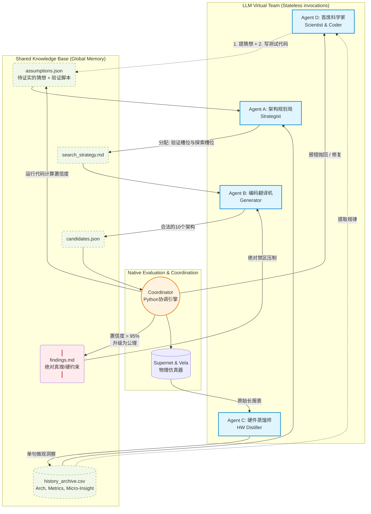

# EdgeFlowNAS Multi-Agent 架构搜索 (Search_v1) 行动计划索引

**更新时间**: 2026-03-04
**状态**: Active
**项目**: MCUFlowNet/EdgeFlowNAS

## 1. 核心目标
本阶段致力于使用 `CoLLM-NAS` 论文启发的 **LLM Multi-Agent 协同机制**，在已经训练好的 `Supernet_v1` 上进行架构搜索。
结合 Vela Compiler 提供的全栈硬件 Profiling 报告，实现基于 **假设驱动法 (Hypothesis-Driven Method)** 的软硬协同搜索。

### 搜索空间严格声明（Guardrails）
*   **不包含**：通道数(Channels)搜索。
*   **只包含积木深度与核大小 (9维 `arch_code`, 取值 0,1,2)**：
    *   [0~3] 深度维度: `EB0, EB1, DB0, DB1` (0=Deep1, 1=Deep2, 2=Deep3)
    *   [4~8] 感受野/核大小: `H0Out, H1, H1Out, H2, H2Out` (0=3x3, 1=5x5, 2=7x7)

## 2. 角色职责与微观/宏观解耦 (The 5-Entity System)

| 角色 | 属性与频率 | 输入 (Read) | 核心职责与设计考量 | 输出 (Write) |
| --- | --- | --- | --- | --- |
| **Agent C: 硬件蒸馏师 (HW Distiller)** | **每轮** *(对单子网)* | 单层 Vela 原生报表 | **底层硬件验收员**。利用充足的单轮上下文，阅读冗长晦涩的逐层报告，蒸馏为1句核心痛点挂在CSV记录后。 | 写入 CSV `vela_insight` 列 |
| **Agent D: 首席科学家 (Scientist)** | **每 N 轮** (宏观) | 全局 `history_archive.csv` | **提出猜想与提供验证工具**。跳出单轮视线，找出物理规律并提出“猜想(Assumption)”，同时生成验证该猜想的 Python 脚本。 | 设想 `assumptions.json`   代码 `eval_assumptions.py` |
| **Coordinator: 协调引擎 (Engine / Python)**| **中枢** (常驻) | 各种 JSON/Markdown | **全自动跑腿与裁判**。纯 Python 脚本，管理计算 EPE/FPS。**执行 Agent D 写的代码**，计算猜想置信度。若置信度>95%，将其升格为绝对真理(Findings)。捕获异常并甩给 Agent D 修复。 | 升格出 `findings.md` |
| **Agent A: 架构规划局 (Strategist)** | **每轮** (Iter) | `history.csv`, `assumptions.json`, `findings.md` | **实验设计者**。根据当前还没被证实的设想，主动分配一定比例的子网“槽位”去验证猜想，剩余槽位划给探索。 | 战术 `search_strategy.md` |
| **Agent B: 编码翻译机 (Generator)** | **每轮** (Iter) | `search_strategy.md`, `findings.md` | **盲眼执行者**。无历史记忆，被公理级文件 `findings.md` 绝对约束（越界即打回），根据战术精确输出 10 个合法的架构配置。 | 生成 `candidates.json` |

## 3. 假设驱动系统流转图 (Hypothesis-Driven Architecture Diagram)

## 4. 阶段任务拆解 (PI Planning 积压区)

本目录（`search_v1`）按照实施顺序划分为以下核心文档（待逐步落地）：

*   [ ] `01_Search_Environment_and_Space_Semantic.md`
    *   **目标**: 面向 Agent A 和 Agent B 的“世界观设定”。必须将 9 维 `arch_code` (0/1/2) 从纯代码逻辑翻译为结构化的自然语言描述。
*   [ ] `02_Agent_Prompts_Definition.md`
    *   **目标**: 固化 4 个不同 LLM 角色（Strategist, Generator, HW Distiller, Scientist）的 System Prompts。
*   [ ] `03_Coordinator_Engine_Implementation.md`
    *   **目标**: 实现 Python 引擎 `run_agentic_search.py`。
*   [ ] `04_Evaluation_and_Vela_Parsing.md`
    *   **目标**: 明确如何从 `run_supernet_subnet_distribution.py` 中拿到纯净的指标数据给 Agent C 和 Python Engine。
*   [ ] `05_Experiment_and_Logging_Rules.md`
    *   **目标**: 规范化断点续传规则。
